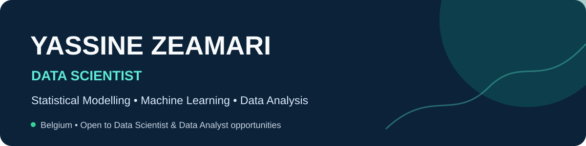

  

  
  
  

## About me

I am a **Data Scientist with a statistical modelling background**, holding an MSc in Data Science (Statistics track) and a BSc in Physics from **UCLouvain**.

I turn complex data into clear, defensible decisions through model selection, validation and interpretation. My interests include **machine learning, time series, Bayesian modelling, risk analytics and quantitative finance**.

- Based in Belgium
- Seeking Data Scientist and Data Analyst opportunities
- Particularly interested in banking, insurance, finance and risk
- Comfortable moving from mathematical formulation to reproducible implementation

## Technical toolkit

**Programming & statistical software**

  
  
  
  
  
  
  
  
  
  

**Data science & development**

  
  
  
  
  
  

**Methods:** supervised and unsupervised learning · regression and classification · Bayesian inference · time-series and state-space models · dimensionality reduction · model selection and interpretation

## Featured work

| Project | What it demonstrates |
|---|---|
| [Dynamic Hedonic Price Indices](https://github.com/yassinedkk/LDAT2M/tree/main/portfolio/dynamic-hedonic-price-indices) | MSc thesis comparing Kalman and score-driven Student-t models for robust, time-varying price indices. |
| [Insurance Claim Prediction](https://github.com/yassinedkk/LDAT2M/tree/main/portfolio/insurance-claim-prediction) | End-to-end predictive modelling for insurance risk, with evaluation and interpretable results. |
| [Multimodal Heart-Risk Modelling](https://github.com/yassinedkk/LDAT2M/tree/main/portfolio/multimodal-heart-risk) | Integration of heterogeneous health data for cardiovascular-risk prediction. |
| [Bayesian Hospital Visits](https://github.com/yassinedkk/LDAT2M/tree/main/portfolio/bayesian-hospital-visits) | Bayesian count modelling, uncertainty quantification and posterior interpretation. |
| [K-means & DBSCAN Clustering](https://github.com/yassinedkk/LDAT2M/tree/main/portfolio/clustering-kmeans-dbscan) | Comparison of centroid- and density-based clustering with reproducible analysis. |
| [Frequent Itemset Mining](https://github.com/yassinedkk/LDAT2M/tree/main/portfolio/frequent-itemset-mining) | Apriori and Eclat implementations tested on real transaction datasets. |

  <a href="https://github.com/yassinedkk/LDAT2M"><strong>View the complete data-science portfolio →</strong></a>

## Contact

I am open to opportunities where statistical thinking and machine learning support real decisions.

**Email:** [zea.yassine@gmail.com](mailto:zea.yassine@gmail.com)  
**GitHub portfolio:** [yassinedkk/LDAT2M](https://github.com/yassinedkk/LDAT2M)
